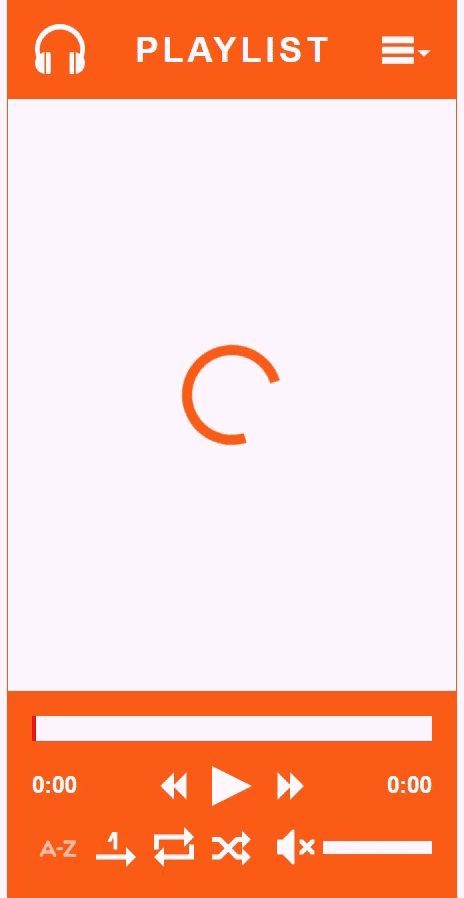

# Music Player app
## Introduction
The aim of the project is to improve skills in using React Hooks and  receive experience in creating applications with Media Elements.

## Technologies
* JS ES6+
* React (Hooks, HOC)
* CSS (SASS/SCSS, BEM)
* basic NodeJS & Express
* basic Babel & Webpack

## Illustrations


### Installation
```
npm install
```

### Usage
```
npm start
```

### Build project
```
npm run build
```